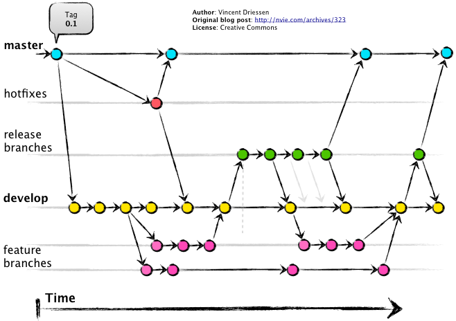

# WELCOME TO PNL ltd

## Git follow

- **Commit**: [Your name] description commit
- **Pull request**: [Your name] description PR
- **Hot fix**: [Your name] description hot fix
- **Branch name**: [Your name] branch name

🌟**B1:** Khi nhận 1 task. Bạn sẽ checkout branch mới từ nhánh **develop** 🆘 *Đảm bảo là bạn đã fetch và pull code mới nhất ở develop* 🆘  
Hãy đặt tên nhánh tính năng của bạn theo nguyên tắt nêu trên. Khi hoàn thành công việc hãy tự review lại commit của mình, files changed. Khi đảm bảo nọi thứ đúng yêu cầu, sạch sẽ hãy tạo PR vào develop và ping vào group (tag 🥷**Long Nguyen** hoặc 🥷**Phu Le**) để được review PR. 
Trong lúc đợi review PR bạn có thể quay lại **B1** và làm tiếp công việc.   💥 Trong trường hợp bạn bị block vì task đợi PR hãy ping lên group hoặc báo leen group để được hỗ trợ.

## How to get tasks?
1. Nơi làm việc.
- Zalo
- Slack
- Github  
Liên hệ 🥷**Phu Le** và check email để join.
2. Cách bạn nhận công việc và hoàn thành nó.
- Công việc của bạn sẽ được bàn giao từ 🥷**Long Nguyen**. Nếu có thắc mắc hoặc câu hỏi vui lòng liên hệ 🥷**Phu Le**.
- Bạn sẽ nhận công việc trên <a href="https://clickup.com/" target="_blank">Clickup</a>. Thường thì sẽ bạn nhận được email tham gia. Nếu chưa nhận được vui lòng chủ động liên hệ 🥷**Phu Le**  
Quy trình để bạn hoàn thành 1 task:
- Chọn đúng dự án bạn tham gia.
- Xem, đọc kỹ yêu cầu, dealine task được giao, Nếu có thắc mắc vui lòng hỏi ngay trên group.
- 1 Task được xem là hoàn thành và được phép tạo PR khi bạn hoàn thành tất cả yêu cầu về UI, responsive, integrate api,... [Trong một số trường hợp đặc biệt có thể bạn sẽ được tạo PR khi task chưa hoàn thành].
3. Trước khi vào việc. hãy đọc phần thông tin dự án ở card "thông tin dự án" trong backlog column tại <a href="https://clickup.com/" target="_blank">Clickup</a> để hiểu bạn đang làm về gì, cái gì, các thông tin về design, chức năng, mục tiêu.

## Resolve conflict and discus them
1. Khi gặp conflict code của bạn với các thành viên khác trong Team nếu nó liên quan đến các phần bạn thay đổi là bạn chắc chắn về điều đó hãy resolve nó. Ngược lại hãy tìm người conflict với bạn để giải quyết

## Tech we love
1.  NextJs 
2.  NestJs 
3.  Flutter 
4. Python, React, Angular, Node.js, Docker, ORMs, NoSQL, SQL,...
### HAPPY WORKING 💯

